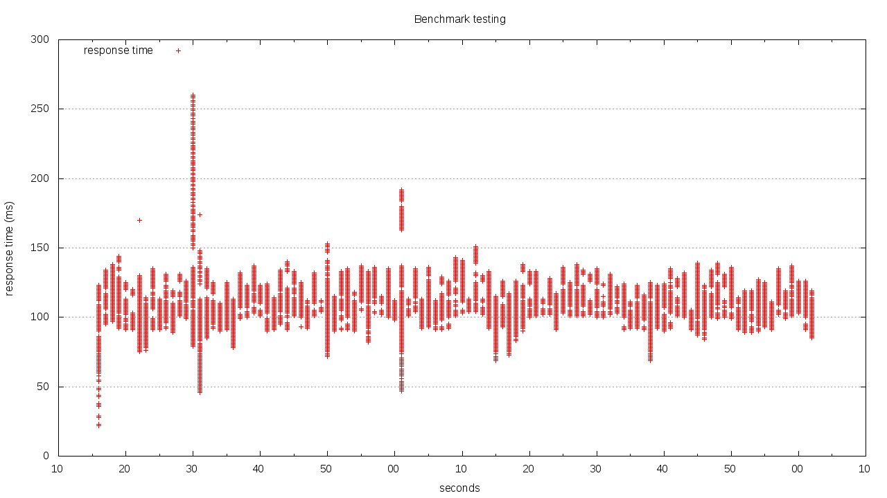
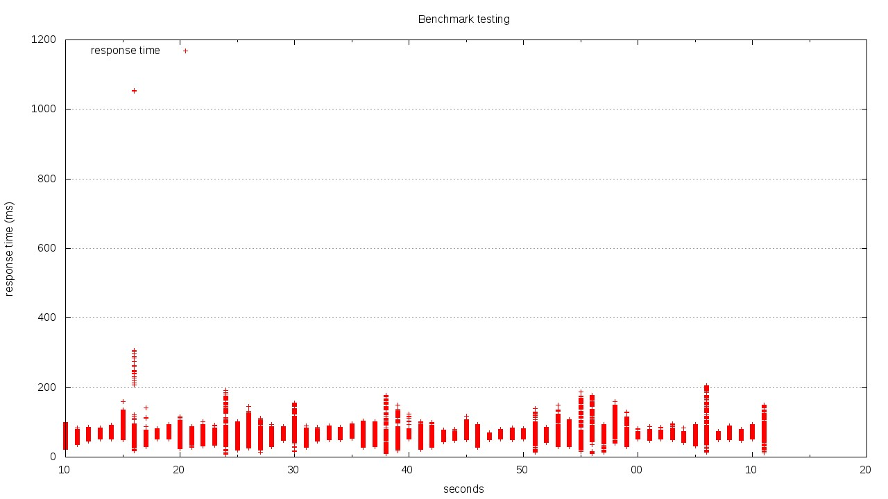

# Meteor Benchmarking

This is a simple benchmarking test comparing performance of Node.js and nginx.

## Scenario and setups

Two servers:

1. meteor
1. comet

Meteor runs Node.js, MongoDB, and nginx. Comet is used to act as a client.

### Setup 1: Test Root for Node.JS

* [Config file Node.JS](app/mup.json)

Deployment via mup, all requests go directly to Meteor at `http://meteor:3000`

### Setup 2: Test Root for Nginx as proxy

* [Config file Node.JS](app/mup.json)
* [Config file Nginx](config/meteorJustProxy.conf)

Use the [configuration for nginx as a proxy](config/meteorJustProxy.conf). Nginx forwards all requests to the upstream Node.JS server at Port 3000.

### Setup 3: Test Root for Nginx as proxy + serving static files

* [Config file Node.JS](app/mup.json)
* [Config file Nginx](config/meteorServeStatic.conf)

Similar to setup 2 - proxy all requests to / to Port 3000 (Node.JS), but all requests for CSS, JS, and images are served by Nginx directly.

### Setup 4: Request an image from Node.JS

* [Config file Node.JS](app/mup.json)

Similar to the tests before, only this time ab requests an image (100k jpg file). Served from Node.js.

### Setup 5: Request an image from Nginx as Node.JS proxy

* [Config file Node.JS](app/mup.json)
* [Config file Nginx](config/meteorJustProxy.conf)

Serving the image from Nginx, with a configuration to pass requests to Node.JS.

### Setup 6: Request an image from Nginx serving static

* [Config file Node.JS](app/mup.json)
* [Config file Nginx](config/meteorServeStatic.conf)

Added static files as locations to Nginx config, serving from Nginx rather than Node.JS.

## Results

### Testing Root

Requesting the root path using Apache Bench (ab) with

`ab -n100000 -c100 -g plotdata.tsv http://meteor/`

| Result | Node.JS | Nginx (just proxy) | Nginx (serving static assets) |
|--------|---------|-------|
| Requests | 100000 | 100000|100000 |
| Time taken (s) | 307.394 |82.325 | 55.778 |
| Requests per second |325.32 |1214.70 |1792.82 |
| Time per request (ms) (mean, across all concurrent requests) | 3.074 |0.823|0.558|
| Transfer rate (Kbytes/sec)|   262.09|1041.51  |1537.21  |

#### Node.JS

#### Nginx as proxy

#### Nginx serving static assets

### Testing an image

Requesting an image (100018 bytes) with

`ab -n100000 -c100 -g plotdata.tsv http://meteor/image.jpg`

| Result | Node.JS | Nginx (just proxy) | Nginx (serving static assets) |
|--------|---------|-------|
| Requests | 100000 | 100000|100000 |
| Time taken (s) | 134.426 |107.281  | 65.902 |
| Requests per second |743.91 | 932.14 |1517.41 |
| Time per request (ms) (mean, across all concurrent requests) | 1.344 |1.073|0.659|
| Transfer rate (Kbytes/sec)|   72866.38|91331.10 |148741.82  |

#### Node.JS

#### Nginx as proxy

#### Nginx serving static assets

## To do

Test with same specs - use only a single core for nginx.

## Specs

Both machines are equally equipped:

* Same underlying host
* KVM machines with
* 2 GB RAM
* 1 Proc with 2 Cores (virtual)
* Intel E1000 NIC (virtual)

## Misc

Plotting of the graphs was done using Gnuplot with inspiration from [Brad Landers](http://www.bradlanders.com/2013/04/15/apache-bench-and-gnuplot-youre-probably-doing-it-wrong/). Use [the gnuplot script](config/gnuplotScript) like this:

`$ gnuplot gnuPlotScript`