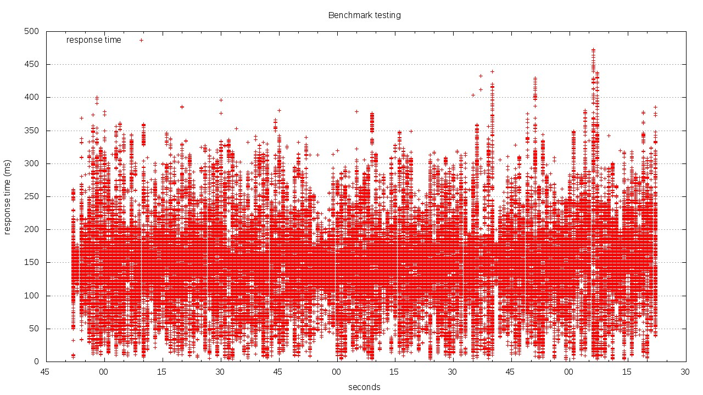

# Meteor Benchmarking

This is a simple benchmarking test comparing performance of Node.js and nginx.

**Disclaimer** These are some preliminary tests I have conducted on a weekend. I still have to prepare a more thorough test series that takes into account more real-world scenarios.

## TL;DR

The test clearly shows that putting nginx in front of a Node.JS (or Meteor) application greatly increases response times for initial requests to the root path and static assets.

However, Node.JS performs much better for serving a single image than for serving the root path.

Naturally, having a multi-core system where nginx can take advantage of all cores will bring better results compared to Meteor which runs on a single core by default.

## Scenario and setups

Two servers:

1. meteor
1. comet

Meteor runs Node.js, MongoDB, and nginx. Comet acts as a client. These tests have been conducted on a single core, single processor machine. [Here are the results with 2 cores](Results2Cores.md) (all other specs remain).

### Setup 1: Test Root for Node.JS

* [Config file Node.JS](app/mup.json)

Deployment via mup, all requests go directly to Meteor at `http://meteor:3000`

### Setup 2: Test Root for Nginx as proxy

* [Config file Node.JS](app/mup.json)
* [Config file Nginx](config/meteorJustProxy.conf)

Use the [configuration for nginx as a proxy](config/meteorJustProxy.conf). Nginx forwards all requests to the upstream Node.JS server at Port 3000.

### Setup 3: Test Root for Nginx as proxy + serving static files

* [Config file Node.JS](app/mup.json)
* [Config file Nginx](config/meteorServeStatic.conf)

Similar to setup 2 - proxy all requests to / to Port 3000 (Node.JS), but all requests for CSS, JS, and images are served by Nginx directly.

### Setup 4: Request an image from Node.JS

* [Config file Node.JS](app/mup.json)

Similar to the tests before, only this time ab requests an image (100k jpg file). Served from Node.js.

### Setup 5: Request an image from Nginx as Node.JS proxy

* [Config file Node.JS](app/mup.json)
* [Config file Nginx](config/meteorJustProxy.conf)

Serving the image from Nginx, with a configuration to pass requests to Node.JS.

### Setup 6: Request an image from Nginx serving static

* [Config file Node.JS](app/mup.json)
* [Config file Nginx](config/meteorServeStatic.conf)

Added static files as locations to Nginx config, serving from Nginx rather than Node.JS.

## Results

[How to read the graphs](Graphs.md)

### Testing Root

Requesting the root path using Apache Bench (ab) with

`ab -n100000 -c100 -g plotdata.tsv http://meteor/`

| Result | Node.JS | Nginx (just proxy) | Nginx (serving static assets) |
|--------|---------:|-------:|-------:|
| Requests | 100000 | 100000 | 100000 |
| Time taken (s) | 299.050 | 106.313 | 108.380 |
| Requests per second | 334.39 | 940.62 | 922.68 |
| Time per request (ms) (mean, across all concurrent requests) | 2.991 | 1.063 | 1.084 |
| Transfer rate (Kbytes/sec) |   269.41 | 806.51  | 791.12  |

#### Node.JS

[Apache Bench Results](results/abNodeRoot.txt) | [Raw Timeseries Data](results/rawData/plotdataNodeRoot.tsv)

#### Nginx as proxy

[Apache Bench Results](results/abNginxJustProxyRoot.txt) | [Raw Timeseries Data](results/rawData/plotdataNginxJustProxyRoot.tsv)

#### Nginx serving static assets

[Apache Bench Results](results/abNginxServeStaticRoot.txt) | [Raw Timeseries Data](results/rawData/plotdataNginxServeStaticRoot.tsv)

### Testing an image

Requesting an image (100018 bytes) with

`ab -n100000 -c100 -g plotdata.tsv http://meteor/image.jpg`

| Result | Node.JS | Nginx (just proxy) | Nginx (serving static assets) |
|--------|---------:|-------:|-------:|
| Requests | 100000 | 100000|100000 |
| Time taken (s) | 144.642 | 150.812   | 61.633 |
| Requests per second |691.36 | 663.08 |1622.52 |
| Time per request (ms) (mean, across all concurrent requests) | 1.446 |1.508|0.616|
| Transfer rate (Kbytes/sec)|   67719.94 | 64968.57 |159044.71  |

#### Node.JS

#### Nginx as proxy

[Apache Bench Results](results/abNginxJustProxyImage.txt) | [Raw Timeseries Data](results/rawData/plotdataNginxJustProxyImage.tsv)

#### Nginx serving static assets

[Apache Bench Results](results/abNginxServeStaticImage.txt) | [Raw Timeseries Data](results/rawData/plotdataNginxServeStaticImage.tsv)

## Combined results

| Result | 1a) Node.js (/) | 2a) Node.js (image.jpg) | 1b) Nginx (/, proxy) |  2b) Nginx (image.jpg, proxy) | 3a) Nginx (/, optimized) | 3b) Nginx (image.jpg, optimized) |
| ----                   | ----:   | ----:    | ----:  |  ----:   | ----:   | ----:   |
| Time for test        | 299   | 145   | 106   |  151   | 108   | 62    |
| Reqs/s               | 334   | 691   | 940   |  663   | 923   | 1623  |
| Time per req (ms)    | 2.991 | 1.446 | 1.063 |  1.508 | 1.084 | 0.616 |
| Conn times min (ms)  | 33    | 110   | 21    |  3     | 22    | 7     |
| Conn times mean (ms) | 299   | 145   | 106   |  151   | 108   | 62    |
| Conn times max (ms)  | 490   | 294   | 260   |  473   | 163   | 1055  |

Percentage of reqs served in certain time

| Result | 1a) Node.js (/) | 2a) Node.js (image.jpg) | 1b) Nginx (/, proxy) |  2b) Nginx (image.jpg, proxy) | 3a) Nginx (/, optimized) | 3b) Nginx (image.jpg, optimized) |
| ----   | ----: | ----: | ----: | ----: | ----: | ----:  |
| 50%  | 331 | 139 | 105 | 149 | 107 | 60   |
| 66%  | 346 | 151 | 110 | 167 | 111 | 63   |
| 75%  | 357 | 154 | 112 | 181 | 114 | 66   |
| 80%  | 364 | 156 | 113 | 191 | 116 | 67   |
| 90%  | 397 | 164 | 118 | 223 | 122 | 73   |
| 95%  | 420 | 175 | 124 | 255 | 127 | 80   |
| 98%  | 447 | 194 | 131 | 293 | 132 | 90   |
| 99%  | 459 | 206 | 134 | 315 | 135 | 98   |
| 100% | 490 | 294 | 260 | 473 | 163 | 1055 |

## Specs

Both machines are equally equipped:

* Same underlying host
* KVM machines with
* 2 GB RAM
* 1 Proc with 1 Core (virtual)
* Intel E1000 NIC (virtual)

## Misc

Plotting of the graphs was done using Gnuplot with inspiration from [Brad Landers](http://www.bradlanders.com/2013/04/15/apache-bench-and-gnuplot-youre-probably-doing-it-wrong/). Use [the gnuplot script](config/gnuplotScript) like this:

`$ gnuplot gnuPlotScript`
